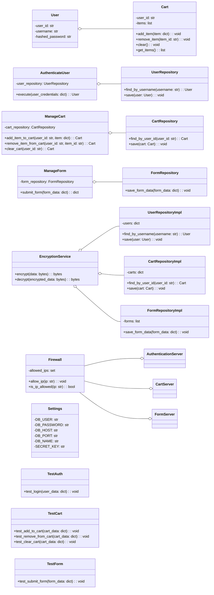

```mermaid
classDiagram
direction LR

class User {
    -user_id: str
    -username: str
    -hashed_password: str
}

class Cart {
    -user_id: str
    -items: list
    +add_item(item: dict): void
    +remove_item(item_id: str): void
    +clear(): void
    +get_items(): list
}

class UserRepository {
    +find_by_username(username: str): User
    +save(user: User): void
}

class CartRepository {
    +find_by_user_id(user_id: str): Cart
    +save(cart: Cart): void
}

class FormRepository {
    +save_form_data(form_data: dict): void
}

class AuthenticateUser {
    -user_repository: UserRepository
    +execute(user_credentials: dict): User
}

class ManageCart {
    -cart_repository: CartRepository
    +add_item_to_cart(user_id: str, item: dict): Cart
    +remove_item_from_cart(user_id: str, item_id: str): Cart
    +clear_cart(user_id: str): Cart
}

class ManageForm {
    -form_repository: FormRepository
    +submit_form(form_data: dict): dict
}

class EncryptionService {
    +encrypt(data: bytes): bytes
    +decrypt(encrypted_data: bytes): bytes
}

class Firewall {
    -allowed_ips: set
    +allow_ip(ip: str): void
    +is_ip_allowed(ip: str): bool
}

class UserRepositoryImpl {
    -users: dict
    +find_by_username(username: str): User
    +save(user: User): void
}

class CartRepositoryImpl {
    -carts: dict
    +find_by_user_id(user_id: str): Cart
    +save(cart: Cart): void
}

class FormRepositoryImpl {
    -forms: list
    +save_form_data(form_data: dict): void
}

class Settings {
    -DB_USER: str
    -DB_PASSWORD: str
    -DB_HOST: str
    -DB_PORT: str
    -DB_NAME: str
    -SECRET_KEY: str
}

class TestAuth {
    +test_login(user_data: dict): void
}

class TestCart {
    +test_add_to_cart(cart_data: dict): void
    +test_remove_from_cart(cart_data: dict): void
    +test_clear_cart(cart_data: dict): void
}

class TestForm {
    +test_submit_form(form_data: dict): void
}

User o-- Cart
AuthenticateUser o-- UserRepository
ManageCart o-- CartRepository
ManageForm o-- FormRepository
EncryptionService o-- UserRepositoryImpl
EncryptionService o-- CartRepositoryImpl
EncryptionService o-- FormRepositoryImpl
Firewall --o AuthenticationServer
Firewall --o CartServer
Firewall --o FormServer
```
