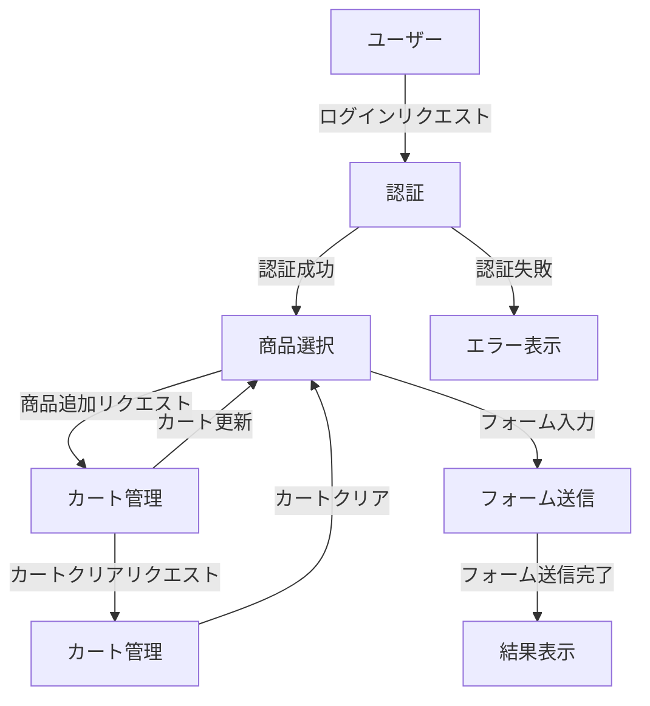
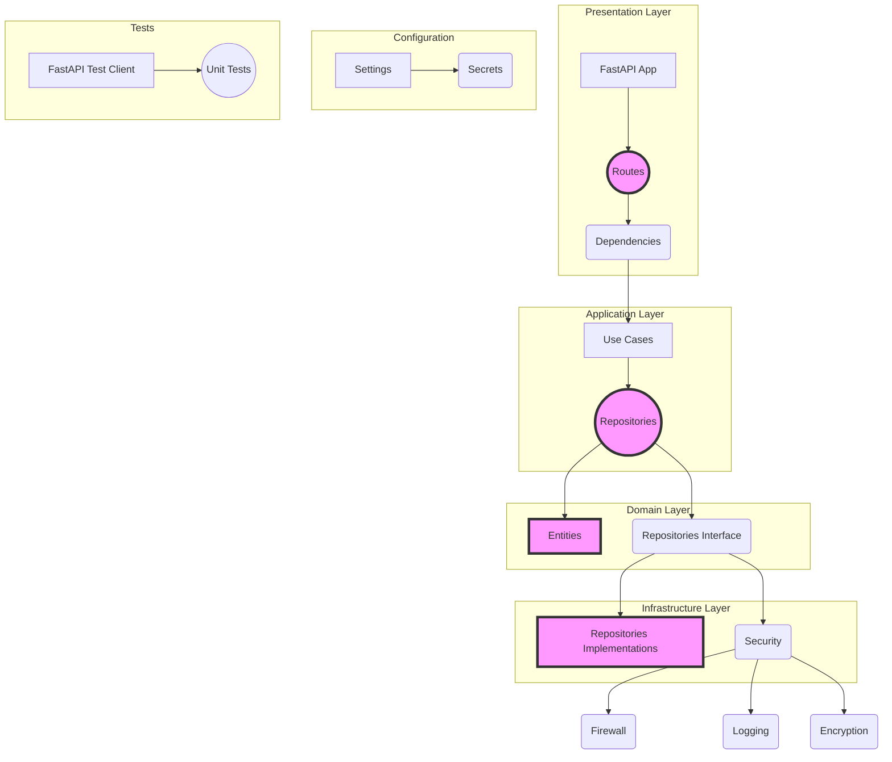

```mermaid
graph TD
    A[ユーザー] -->|ログインリクエスト| B[認証]
    B -->|認証成功| C[商品選択]
    C -->|商品追加リクエスト| D[カート管理]
    D -->|カート更新| C
    C -->|フォーム入力| E[フォーム送信]
    E -->|フォーム送信完了| F[結果表示]
    B -->|認証失敗| G[エラー表示]
    D -->|カートクリアリクエスト| H[カート管理]
    H -->|カートクリア| C
```

```mermaid
flowchart TD

subgraph "Presentation Layer"
    A[FastAPI App] --> B((Routes))
    B --> C(Dependencies)
    style B fill:#f9f,stroke:#333,stroke-width:4px
end

subgraph "Application Layer"
    C --> D[Use Cases]
    D --> E((Repositories))
    style E fill:#f9f,stroke:#333,stroke-width:4px
end

subgraph "Domain Layer"
    E --> F[Entities]
    E --> G(Repositories Interface)
    style F fill:#f9f,stroke:#333,stroke-width:4px
end

subgraph "Infrastructure Layer"
    G --> H[Repositories Implementations]
    G --> I(Security)
    style H fill:#f9f,stroke:#333,stroke-width:4px
end

subgraph "Configuration"
    J[Settings]
    J --> K(Secrets)
end

subgraph "Tests"
    L[FastAPI Test Client] --> M((Unit Tests))
end

I --> N(Firewall)
I --> O(Logging)
I --> P(Encryption)

```
