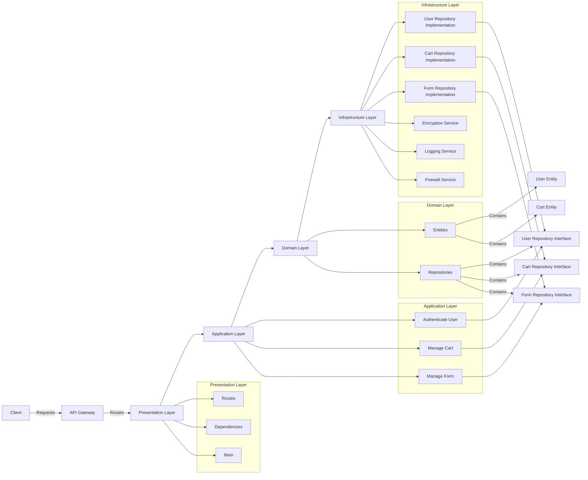
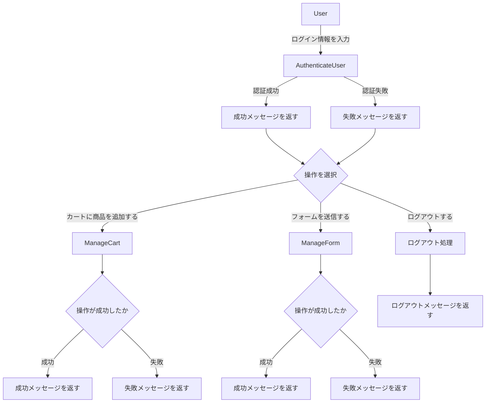
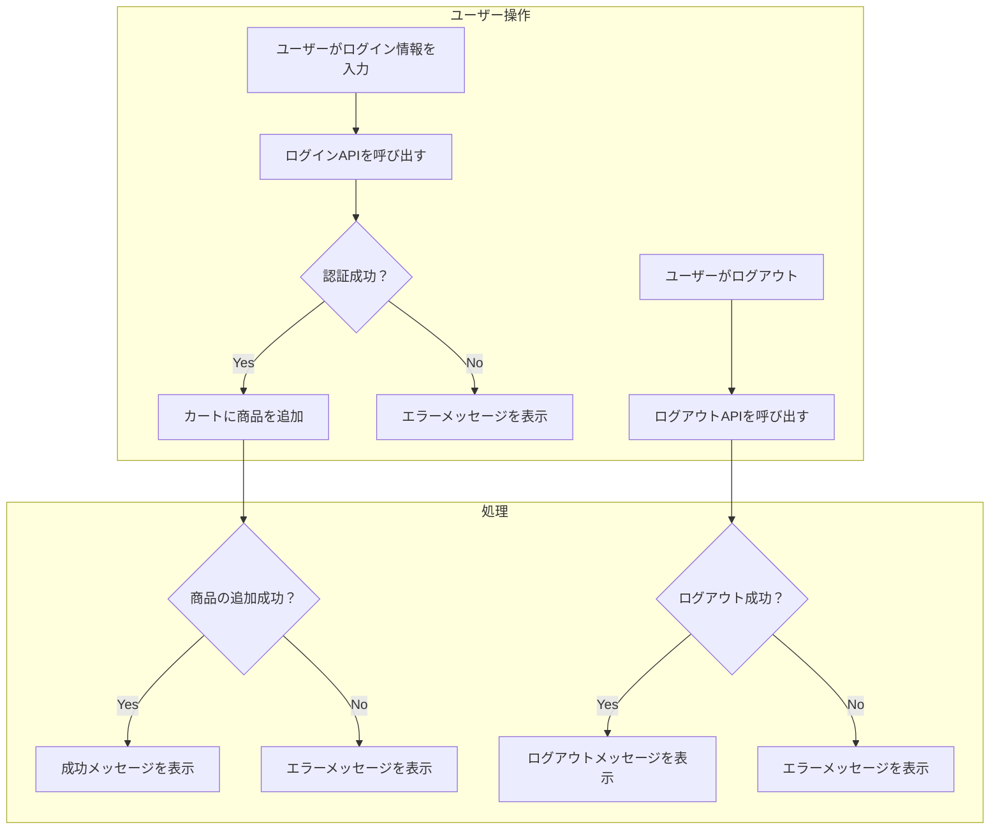
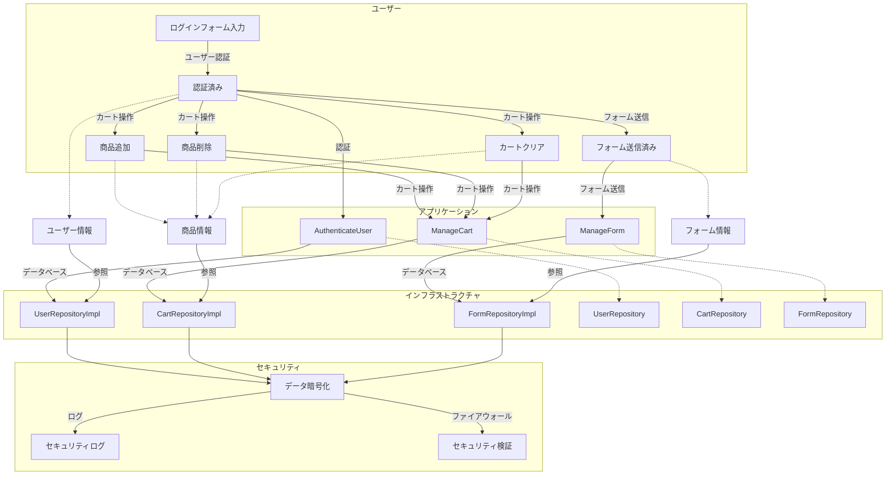

```mermaid
graph LR
    A[Client] -->|Requests| B[API Gateway]
    B -->|Routes| C[Presentation Layer]
    C --> D[Application Layer]
    D --> E[Domain Layer]
    E --> F[Infrastructure Layer]

    subgraph Presentation Layer
        C1[Routes]
        C2[Dependencies]
        C3[Main]
    end

    subgraph Application Layer
        D1[Authenticate User]
        D2[Manage Cart]
        D3[Manage Form]
    end

    subgraph Domain Layer
        E1[Entities]
        E2[Repositories]
    end

    subgraph Infrastructure Layer
        F1[User Repository Implementation]
        F2[Cart Repository Implementation]
        F3[Form Repository Implementation]
        F4[Encryption Service]
        F5[Logging Service]
        F6[Firewall Service]
    end

    C --> C1
    C --> C2
    C --> C3

    D --> D1
    D --> D2
    D --> D3

    E --> E1
    E --> E2

    E1 --> |Contains| E1a[User Entity]
    E1 --> |Contains| E1b[Cart Entity]

    E2 --> |Contains| E2a[User Repository Interface]
    E2 --> |Contains| E2b[Cart Repository Interface]
    E2 --> |Contains| E2c[Form Repository Interface]

    F --> F1
    F --> F2
    F --> F3
    F --> F4
    F --> F5
    F --> F6

    F1 --> E2a
    F2 --> E2b
    F3 --> E2c
    D1 --> E2a
    D2 --> E2b
    D3 --> E2c
```

```mermaid

graph TD
    A[User] -->|ログイン情報を入力| B[AuthenticateUser]
    B -->|認証成功| C[成功メッセージを返す]
    B -->|認証失敗| D[失敗メッセージを返す]
    C --> E{操作を選択}
    D --> E{操作を選択}
    E -->|カートに商品を追加する| F[ManageCart]
    F --> G{操作が成功したか}
    G -->|成功| H[成功メッセージを返す]
    G -->|失敗| I[失敗メッセージを返す]
    E -->|フォームを送信する| J[ManageForm]
    J --> K{操作が成功したか}
    K -->|成功| L[成功メッセージを返す]
    K -->|失敗| M[失敗メッセージを返す]
    E -->|ログアウトする| N[ログアウト処理]
    N --> O[ログアウトメッセージを返す]
```

```mermaid
graph TD;

subgraph "ユーザー操作"
    A[ユーザーがログイン情報を入力] --> B[ログインAPIを呼び出す]
    B --> C{認証成功？}
    C -- Yes --> D[カートに商品を追加]
    C -- No --> E[エラーメッセージを表示]
end

subgraph "処理"
    D --> F{商品の追加成功？}
    F -- Yes --> G[成功メッセージを表示]
    F -- No --> H[エラーメッセージを表示]
end

subgraph "ユーザー操作"
    I[ユーザーがログアウト] --> J[ログアウトAPIを呼び出す]
end

subgraph "処理"
    J --> K{ログアウト成功？}
    K -- Yes --> L[ログアウトメッセージを表示]
    K -- No --> M[エラーメッセージを表示]
end
```

```mermaid
graph TD;

    subgraph "ユーザー"
        A[ログインフォーム入力] -->|ユーザー認証| B[認証済み]
        B -->|カート操作| C[商品追加]
        B -->|カート操作| D[商品削除]
        B -->|カート操作| E[カートクリア]
        B -->|フォーム送信| F[フォーム送信済み]
    end

    subgraph "アプリケーション"
        B -->|認証| G[AuthenticateUser]
        C -->|カート操作| H[ManageCart]
        D -->|カート操作| H
        E -->|カート操作| H
        F -->|フォーム送信| I[ManageForm]
    end

    subgraph "インフラストラクチャ"
        G -->|データベース| J[UserRepositoryImpl]
        H -->|データベース| K[CartRepositoryImpl]
        I -->|データベース| L[FormRepositoryImpl]
        G -.-> M[UserRepository]
        H -.-> N[CartRepository]
        I -.-> O[FormRepository]
    end

    subgraph "セキュリティ"
        J --> P[データ暗号化]
        K --> P
        L --> P
        P -->|ログ| Q[セキュリティログ]
        P -->|ファイアウォール| R[セキュリティ検証]
    end

    B -.-> S[ユーザー情報]
    C -.-> T[商品情報]
    D -.-> T
    E -.-> T
    F -.-> U[フォーム情報]
    S -->|参照| J
    T -->|参照| K
    U -->|参照| L
```
