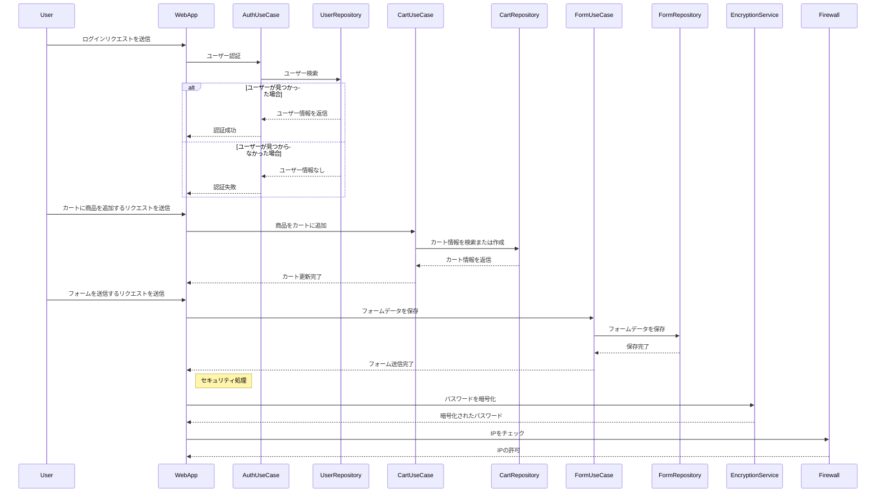

```mermaid
sequenceDiagram
    participant User
    participant WebApp
    participant AuthUseCase
    participant UserRepository
    participant CartUseCase
    participant CartRepository
    participant FormUseCase
    participant FormRepository
    participant EncryptionService
    participant Firewall

    User ->> WebApp: ログインリクエストを送信
    WebApp ->> AuthUseCase: ユーザー認証
    AuthUseCase ->> UserRepository: ユーザー検索
    alt ユーザーが見つかった場合
        UserRepository -->> AuthUseCase: ユーザー情報を返信
        AuthUseCase -->> WebApp: 認証成功
    else ユーザーが見つからなかった場合
        UserRepository -->> AuthUseCase: ユーザー情報なし
        AuthUseCase -->> WebApp: 認証失敗
    end

    User ->> WebApp: カートに商品を追加するリクエストを送信
    WebApp ->> CartUseCase: 商品をカートに追加
    CartUseCase ->> CartRepository: カート情報を検索または作成
    CartRepository -->> CartUseCase: カート情報を返信
    CartUseCase -->> WebApp: カート更新完了

    User ->> WebApp: フォームを送信するリクエストを送信
    WebApp ->> FormUseCase: フォームデータを保存
    FormUseCase ->> FormRepository: フォームデータを保存
    FormRepository -->> FormUseCase: 保存完了
    FormUseCase -->> WebApp: フォーム送信完了

    Note right of WebApp: セキュリティ処理
    WebApp ->> EncryptionService: パスワードを暗号化
    EncryptionService -->> WebApp: 暗号化されたパスワード
    WebApp ->> Firewall: IPをチェック
    Firewall -->> WebApp: IPの許可
```
