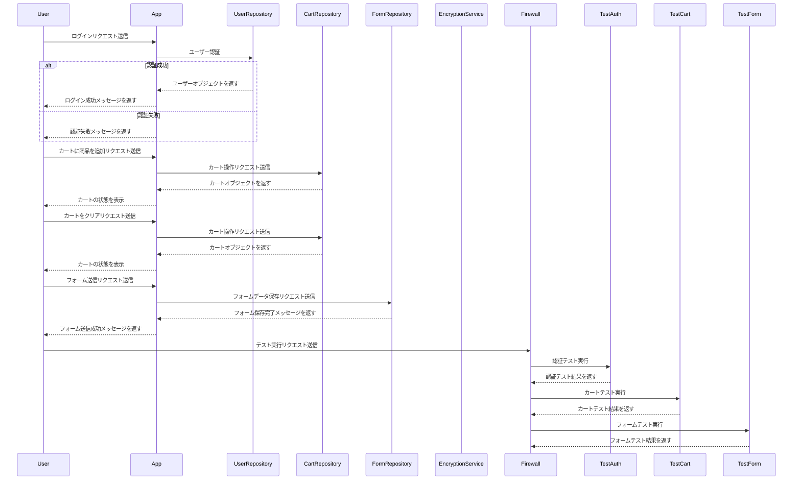

```mermaid
sequenceDiagram
    participant User
    participant App
    participant UserRepository
    participant CartRepository
    participant FormRepository
    participant EncryptionService
    participant Firewall
    participant TestAuth
    participant TestCart
    participant TestForm

    User ->> App: ログインリクエスト送信
    App ->> UserRepository: ユーザー認証
    alt 認証成功
        UserRepository -->> App: ユーザーオブジェクトを返す
        App -->> User: ログイン成功メッセージを返す
    else 認証失敗
        App -->> User: 認証失敗メッセージを返す
    end

    User ->> App: カートに商品を追加リクエスト送信
    App ->> CartRepository: カート操作リクエスト送信
    CartRepository -->> App: カートオブジェクトを返す
    App -->> User: カートの状態を表示

    User ->> App: カートをクリアリクエスト送信
    App ->> CartRepository: カート操作リクエスト送信
    CartRepository -->> App: カートオブジェクトを返す
    App -->> User: カートの状態を表示

    User ->> App: フォーム送信リクエスト送信
    App ->> FormRepository: フォームデータ保存リクエスト送信
    FormRepository -->> App: フォーム保存完了メッセージを返す
    App -->> User: フォーム送信成功メッセージを返す

    User ->> Firewall: テスト実行リクエスト送信
    Firewall ->> TestAuth: 認証テスト実行
    TestAuth -->> Firewall: 認証テスト結果を返す
    Firewall ->> TestCart: カートテスト実行
    TestCart -->> Firewall: カートテスト結果を返す
    Firewall ->> TestForm: フォームテスト実行
    TestForm -->> Firewall: フォームテスト結果を返す
```
