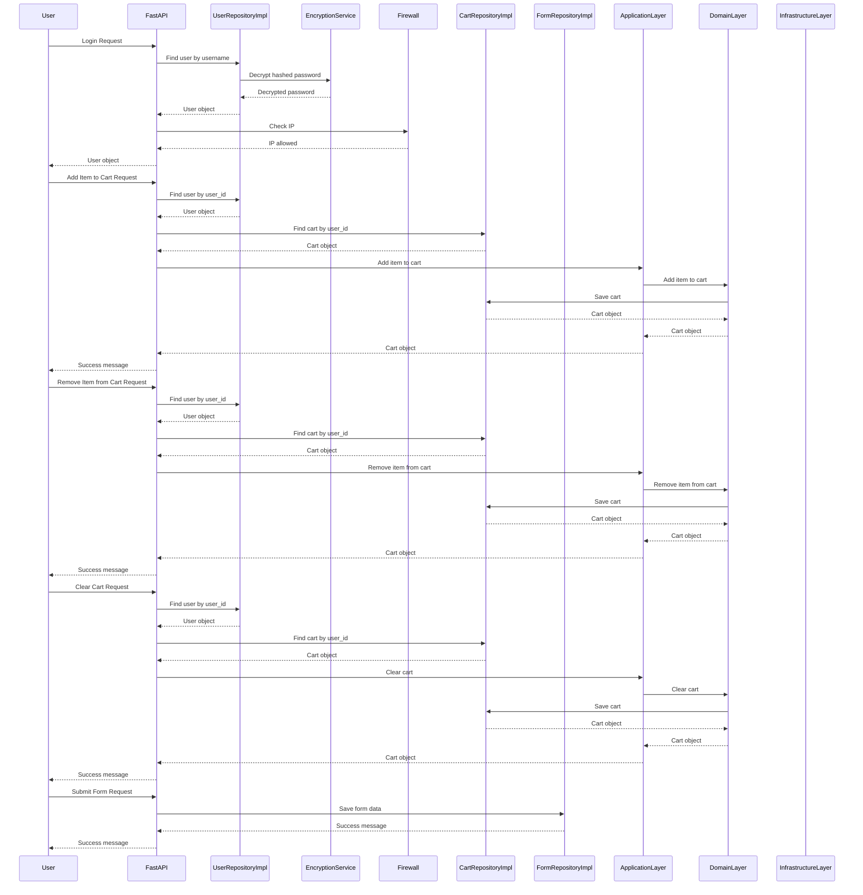

```mermaid
sequenceDiagram
    participant User
    participant FastAPI
    participant UserRepositoryImpl
    participant EncryptionService
    participant Firewall
    participant CartRepositoryImpl
    participant FormRepositoryImpl
    participant ApplicationLayer
    participant DomainLayer
    participant InfrastructureLayer

    User->>FastAPI: Login Request
    FastAPI->>UserRepositoryImpl: Find user by username
    UserRepositoryImpl->>EncryptionService: Decrypt hashed password
    EncryptionService-->>UserRepositoryImpl: Decrypted password
    UserRepositoryImpl-->>FastAPI: User object
    FastAPI->>Firewall: Check IP
    Firewall-->>FastAPI: IP allowed
    FastAPI-->>User: User object

    User->>FastAPI: Add Item to Cart Request
    FastAPI->>UserRepositoryImpl: Find user by user_id
    UserRepositoryImpl-->>FastAPI: User object
    FastAPI->>CartRepositoryImpl: Find cart by user_id
    CartRepositoryImpl-->>FastAPI: Cart object
    FastAPI->>ApplicationLayer: Add item to cart
    ApplicationLayer->>DomainLayer: Add item to cart
    DomainLayer->>CartRepositoryImpl: Save cart
    CartRepositoryImpl-->>DomainLayer: Cart object
    DomainLayer-->>ApplicationLayer: Cart object
    ApplicationLayer-->>FastAPI: Cart object
    FastAPI-->>User: Success message

    User->>FastAPI: Remove Item from Cart Request
    FastAPI->>UserRepositoryImpl: Find user by user_id
    UserRepositoryImpl-->>FastAPI: User object
    FastAPI->>CartRepositoryImpl: Find cart by user_id
    CartRepositoryImpl-->>FastAPI: Cart object
    FastAPI->>ApplicationLayer: Remove item from cart
    ApplicationLayer->>DomainLayer: Remove item from cart
    DomainLayer->>CartRepositoryImpl: Save cart
    CartRepositoryImpl-->>DomainLayer: Cart object
    DomainLayer-->>ApplicationLayer: Cart object
    ApplicationLayer-->>FastAPI: Cart object
    FastAPI-->>User: Success message

    User->>FastAPI: Clear Cart Request
    FastAPI->>UserRepositoryImpl: Find user by user_id
    UserRepositoryImpl-->>FastAPI: User object
    FastAPI->>CartRepositoryImpl: Find cart by user_id
    CartRepositoryImpl-->>FastAPI: Cart object
    FastAPI->>ApplicationLayer: Clear cart
    ApplicationLayer->>DomainLayer: Clear cart
    DomainLayer->>CartRepositoryImpl: Save cart
    CartRepositoryImpl-->>DomainLayer: Cart object
    DomainLayer-->>ApplicationLayer: Cart object
    ApplicationLayer-->>FastAPI: Cart object
    FastAPI-->>User: Success message

    User->>FastAPI: Submit Form Request
    FastAPI->>FormRepositoryImpl: Save form data
    FormRepositoryImpl-->>FastAPI: Success message
    FastAPI-->>User: Success message
```