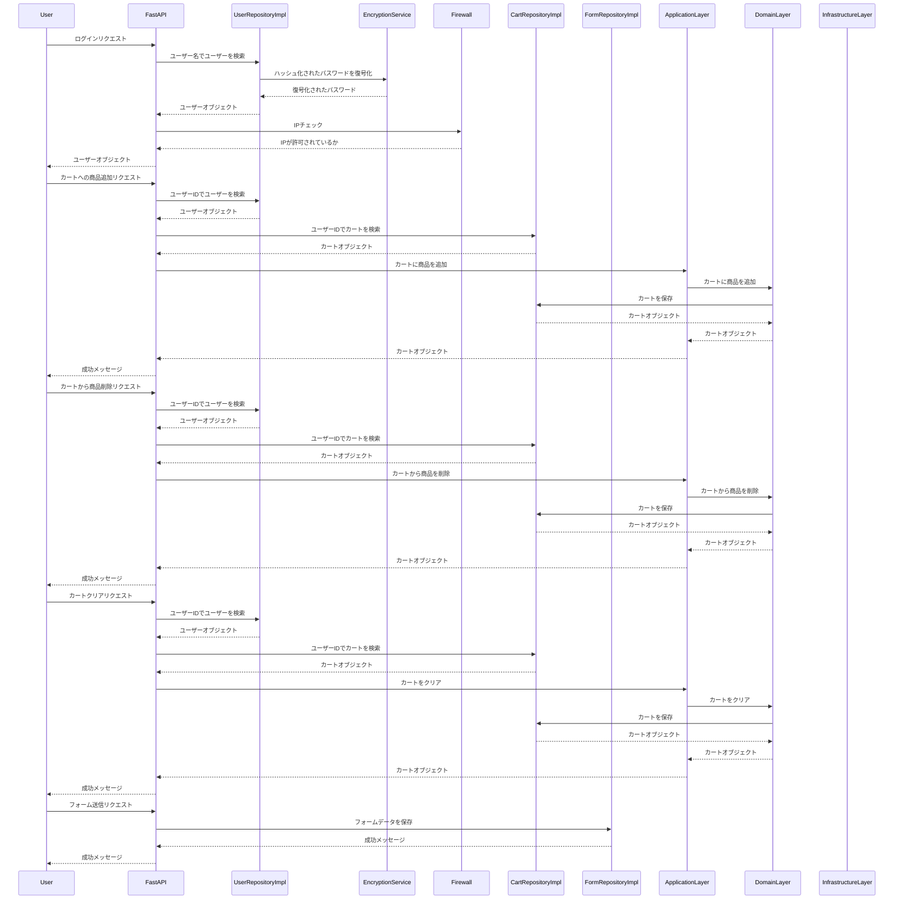

```mermaid
sequenceDiagram
    participant User
    participant FastAPI
    participant UserRepositoryImpl
    participant EncryptionService
    participant Firewall
    participant CartRepositoryImpl
    participant FormRepositoryImpl
    participant ApplicationLayer
    participant DomainLayer
    participant InfrastructureLayer

    User->>FastAPI: ログインリクエスト
    FastAPI->>UserRepositoryImpl: ユーザー名でユーザーを検索
    UserRepositoryImpl->>EncryptionService: ハッシュ化されたパスワードを復号化
    EncryptionService-->>UserRepositoryImpl: 復号化されたパスワード
    UserRepositoryImpl-->>FastAPI: ユーザーオブジェクト
    FastAPI->>Firewall: IPチェック
    Firewall-->>FastAPI: IPが許可されているか
    FastAPI-->>User: ユーザーオブジェクト

    User->>FastAPI: カートへの商品追加リクエスト
    FastAPI->>UserRepositoryImpl: ユーザーIDでユーザーを検索
    UserRepositoryImpl-->>FastAPI: ユーザーオブジェクト
    FastAPI->>CartRepositoryImpl: ユーザーIDでカートを検索
    CartRepositoryImpl-->>FastAPI: カートオブジェクト
    FastAPI->>ApplicationLayer: カートに商品を追加
    ApplicationLayer->>DomainLayer: カートに商品を追加
    DomainLayer->>CartRepositoryImpl: カートを保存
    CartRepositoryImpl-->>DomainLayer: カートオブジェクト
    DomainLayer-->>ApplicationLayer: カートオブジェクト
    ApplicationLayer-->>FastAPI: カートオブジェクト
    FastAPI-->>User: 成功メッセージ

    User->>FastAPI: カートから商品削除リクエスト
    FastAPI->>UserRepositoryImpl: ユーザーIDでユーザーを検索
    UserRepositoryImpl-->>FastAPI: ユーザーオブジェクト
    FastAPI->>CartRepositoryImpl: ユーザーIDでカートを検索
    CartRepositoryImpl-->>FastAPI: カートオブジェクト
    FastAPI->>ApplicationLayer: カートから商品を削除
    ApplicationLayer->>DomainLayer: カートから商品を削除
    DomainLayer->>CartRepositoryImpl: カートを保存
    CartRepositoryImpl-->>DomainLayer: カートオブジェクト
    DomainLayer-->>ApplicationLayer: カートオブジェクト
    ApplicationLayer-->>FastAPI: カートオブジェクト
    FastAPI-->>User: 成功メッセージ

    User->>FastAPI: カートクリアリクエスト
    FastAPI->>UserRepositoryImpl: ユーザーIDでユーザーを検索
    UserRepositoryImpl-->>FastAPI: ユーザーオブジェクト
    FastAPI->>CartRepositoryImpl: ユーザーIDでカートを検索
    CartRepositoryImpl-->>FastAPI: カートオブジェクト
    FastAPI->>ApplicationLayer: カートをクリア
    ApplicationLayer->>DomainLayer: カートをクリア
    DomainLayer->>CartRepositoryImpl: カートを保存
    CartRepositoryImpl-->>DomainLayer: カートオブジェクト
    DomainLayer-->>ApplicationLayer: カートオブジェクト
    ApplicationLayer-->>FastAPI: カートオブジェクト
    FastAPI-->>User: 成功メッセージ

    User->>FastAPI: フォーム送信リクエスト
    FastAPI->>FormRepositoryImpl: フォームデータを保存
    FormRepositoryImpl-->>FastAPI: 成功メッセージ
    FastAPI-->>User: 成功メッセージ
```