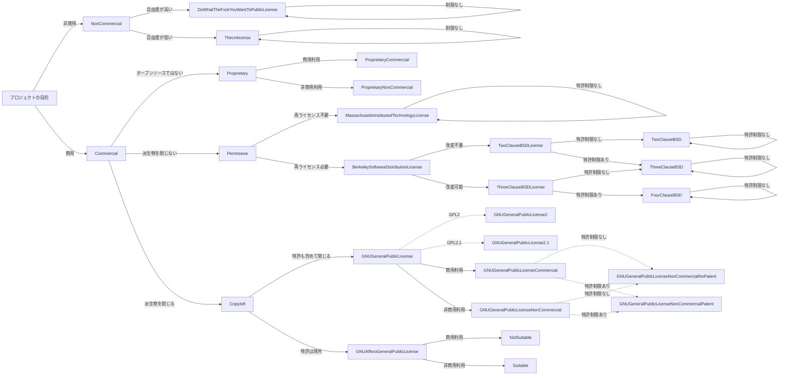

```mermaid
graph LR
    Start[プロジェクトの目的];
    Start -->|非商用| NCM[NonCommercial];
    Start -->|商用| CM[Commercial];
    NCM -->|自由度が高い| WTFPL[DoWhatTheFxckYouWantToPublicLicense];
    NCM -->|自由度が低い| UL[TheUnlicense];
    CM -->|オープンソースではない| Prop[Proprietary];
    CM -->|派生物を閉じない| PM[Permissive];
    CM -->|派生物を閉じる| CL[Copyleft];
    CL -->|特許も含めて閉じる| GPL[GNUGeneralPublicLicense];
    CL -->|特許は除外| AGPL[GNUAfferoGeneralPublicLicense];
    PM -->|再ライセンス不要| MIT[MassachusettsInstituteofTechnologyLicense];
    PM -->|再ライセンス必要| BSD[BerkeleySoftwareDistributionLicense];
    AGPL -->|商用利用| NotSuitable[NotSuitable];
    AGPL -->|非商用利用| Suitable[Suitable];
    BSD -->|改変不要| 2CBSD[TwoClauseBSDLicense];
    BSD -->|改変可能| 3CBSD[ThreeClauseBSDLicense];
    2CBSD -->|特許制限なし| BSD2[TwoClauseBSD];
    2CBSD -->|特許制限あり| BSD3[ThreeClauseBSD];
    3CBSD -->|特許制限なし| BSD3[ThreeClauseBSD];
    3CBSD -->|特許制限あり| BSD4[FourClauseBSD];
    Prop -->|商用利用| PropCM[ProprietaryCommercial];
    Prop -->|非商用利用| PropNCM[ProprietaryNonCommercial];
    GPL -.-> |GPL2| GPL2[GNUGeneralPublicLicense2];
    GPL -.-> |GPL2.1| GPL2.1[GNUGeneralPublicLicense2.1];
    GPL -->|商用利用| GPLCM[GNUGeneralPublicLicenseCommercial];
    GPL -->|非商用利用| GPLNCM[GNUGeneralPublicLicenseNonCommercial];
    GPLCM -.-> |特許制限なし| GPLCMNP[GNUGeneralPublicLicenseCommercialNoPatent];
    GPLCM -.-> |特許制限あり| GPLCMP[GNUGeneralPublicLicenseCommercialPatent];
    GPLNCM -.-> |特許制限なし| GPLCMNP[GNUGeneralPublicLicenseNonCommercialNoPatent];
    GPLNCM -.-> |特許制限あり| GPLCMP[GNUGeneralPublicLicenseNonCommercialPatent];
;
    WTFPL -->|制限なし| WTFPL[DoWhatTheFxckYouWantToPublicLicense];
    UL -->|制限なし| UL[TheUnlicense];
    MIT -->|特許制限なし| MIT[MassachusettsInstituteofTechnologyLicense];
    BSD2 -->|特許制限なし| BSD2[TwoClauseBSD];
    BSD3 -->|特許制限なし| BSD3[ThreeClauseBSD];
    BSD4 -->|特許制限なし| BSD4[FourClauseBSD];
```
