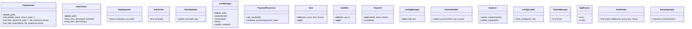

```mermaid
classDiagram
    class FileSearcher {
        +__init__(db_path)
        +find_file(file_name, search_path='.')
        +find_files_all(search_path='.', file_extension=None)
        +find_files_match(items, file_extension=None)
    }
    
    class ItemViewer {
        +__init__(db_path)
        +show_item_desc(state, selected)
        +show_item_demo(*args)
    }
    
    class DataExporter {
        +export_data(data, out_path)
    }
    
    class ItemFinder {
        +find_item(pid)
    }
    
    class StockUpdater {
        +update_stock(pid, qty)
    }
    
    class CartManager {
        +__init__(db_path)
        +add(selected)
        +remove(pid)
        +clear()
        +update_cart(item)
    }
    
    class PaymentProcessor {
        +calc_total(state)
        +complete_payment(payment, state)
    }
    
    class Item {
        +__init__(name, price, desc=None)
        +__repr__()
    }
    
    class CartItem {
        +__init__(item, qty=1)
        +__repr__()
    }
    
    class Payment {
        +__init__(method, status, token)
        +complete()
    }
    
    class ConfigManager {
        +__init__(config, toc)
    }
    
    class ParamHandler {
        +update_params(state, tags, prods)
    }
    
    class Explorer {
        +update_explorer(paths)
        +update_imgs(paths)
    }
    
    class ConfigLoader {
        +load_config(path, key)
    }
    
    class ThemeManager {
        +lit_theme()
    }
    
    class AppRunner {
        +run()
        +main()
    }
    
    class PathFinder {
        +find_paths_all(dataset, group_key, *keys)
    }
    
    class EntrySeparator {
        +separate_entries(entries)
    }
```