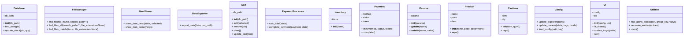

```mermaid
classDiagram
    class Database {
        - db_path
        + __init__(db_path)
        + find_item(pid)
        + update_stock(pid, qty)
    }
    
    class FileManager {
        + find_file(file_name, search_path='.')
        + find_files_all(search_path='.', file_extension=None)
        + find_files_match(items, file_extension=None)
    }
    
    class ItemViewer {
        + show_item_desc(state, selected)
        + show_item_demo(*args)
    }
    
    class DataExporter {
        + export_data(data, out_path)
    }
    
    class Cart {
        - db_path
        + __init__(db_path)
        + add(selected)
        + remove(pid)
        + clear()
        + update_cart(item)
    }
    
    class PaymentProcessor {
        + calc_total(state)
        + complete_payment(payment, state)
    }
    
    class Inventory {
        - items
        + __init__(items)
    }
    
    class Payment {
        - method
        - status
        - token
        + __init__(method, status, token)
        + complete()
    }
    
    class Params {
        - params
        + __init__(params)
        + __getattr__(name)
        + __setattr__(name, value)
    }
    
    class Product {
        - name
        - price
        - desc
        + __init__(name, price, desc=None)
        + __repr__()
    }
    
    class CartItem {
        - item
        - qty
        + __init__(item, qty=1)
        + __repr__()
    }
    
    class Config {
        + update_explorer(paths)
        + update_params(state, tags, prods)
        + load_config(path, key)
    }
    
    class UI {
        - config
        - toc
        + __init__(config, toc)
        + lit_theme()
        + update_imgs(paths)
        + run()
    }
    
    class Utilities {
        + find_paths_all(dataset, group_key, *keys)
        + separate_entries(entries)
        + main()
    }
```