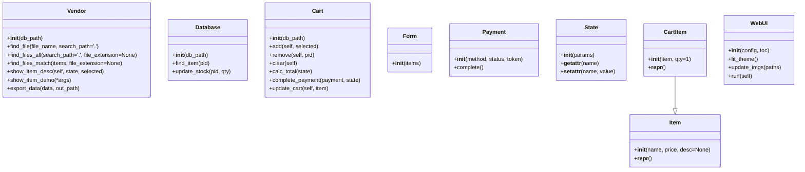

```mermaid
classDiagram
    class Vendor {
        +__init__(db_path)
        +find_file(file_name, search_path='.')
        +find_files_all(search_path='.', file_extension=None)
        +find_files_match(items, file_extension=None)
        +show_item_desc(self, state, selected)
        +show_item_demo(*args)
        +export_data(data, out_path)
    }

    class Database {
        +__init__(db_path)
        +find_item(pid)
        +update_stock(pid, qty)
    }

    class Cart {
        +__init__(db_path)
        +add(self, selected)
        +remove(self, pid)
        +clear(self)
        +calc_total(state)
        +complete_payment(payment, state)
        +update_cart(self, item)
    }

    class Form {
        +__init__(items)
    }

    class Payment {
        +__init__(method, status, token)
        +complete()
    }

    class State {
        +__init__(params)
        +__getattr__(name)
        +__setattr__(name, value)
    }

    class Item {
        +__init__(name, price, desc=None)
        +__repr__()
    }

    class CartItem {
        +__init__(item, qty=1)
        +__repr__()
    }
    CartItem --|> Item

    class WebUI {
        +__init__(config, toc)
        +lit_theme()
        +update_imgs(paths)
        +run(self)
    }
```