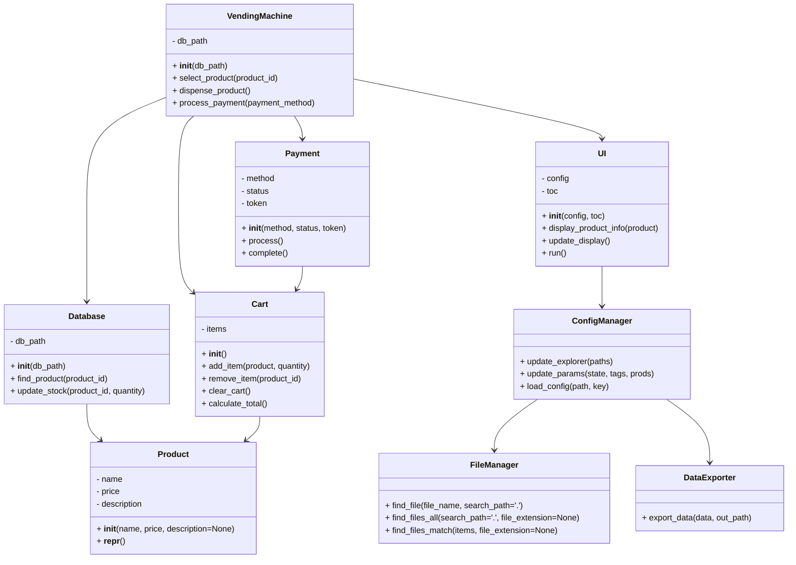

```mermaid
classDiagram
    class VendingMachine {
        - db_path
        + __init__(db_path)
        + select_product(product_id)
        + dispense_product()
        + process_payment(payment_method)
    }
    
    class Database {
        - db_path
        + __init__(db_path)
        + find_product(product_id)
        + update_stock(product_id, quantity)
    }
    
    class Product {
        - name
        - price
        - description
        + __init__(name, price, description=None)
        + __repr__()
    }
    
    class Cart {
        - items
        + __init__()
        + add_item(product, quantity)
        + remove_item(product_id)
        + clear_cart()
        + calculate_total()
    }
    
    class Payment {
        - method
        - status
        - token
        + __init__(method, status, token)
        + process()
        + complete()
    }
    
    class FileManager {
        + find_file(file_name, search_path='.')
        + find_files_all(search_path='.', file_extension=None)
        + find_files_match(items, file_extension=None)
    }
    
    class DataExporter {
        + export_data(data, out_path)
    }
    
    class ConfigManager {
        + update_explorer(paths)
        + update_params(state, tags, prods)
        + load_config(path, key)
    }
    
    class UI {
        - config
        - toc
        + __init__(config, toc)
        + display_product_info(product)
        + update_display()
        + run()
    }
    
    VendingMachine --> Database
    VendingMachine --> Cart
    VendingMachine --> Payment
    VendingMachine --> UI
    Database --> Product
    Cart --> Product
    Payment --> Cart
    ConfigManager --> FileManager
    ConfigManager --> DataExporter
    UI --> ConfigManager
```