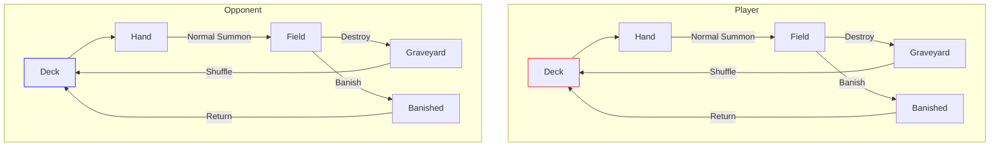

```mermaid
graph TD
%% 自身
    subgraph Player
        Deck[Deck]
        Hand[Hand]
        Field[Field]
        Graveyard[Graveyard]
        Banished[Banished]
        Deck --> Hand
        Hand -->|Normal Summon| Field
        Field -->|Destroy| Graveyard
        Field -->|Banish| Banished
        Graveyard -->|Shuffle| Deck
        Banished -->|Return| Deck
    end

%% 敵
    subgraph Opponent 
        Deck_Opponent[Deck]
        Hand_Opponent[Hand]
        Field_Opponent[Field]
        Graveyard_Opponent[Graveyard]
        Banished_Opponent[Banished]
        Deck_Opponent --> Hand_Opponent
        Hand_Opponent -->|Normal Summon| Field_Opponent
        Field_Opponent -->|Destroy| Graveyard_Opponent
        Field_Opponent -->|Banish| Banished_Opponent
        Graveyard_Opponent -->|Shuffle| Deck_Opponent
        Banished_Opponent -->|Return| Deck_Opponent
    end

style Deck stroke: red
style Deck_Opponent stroke: blue
```