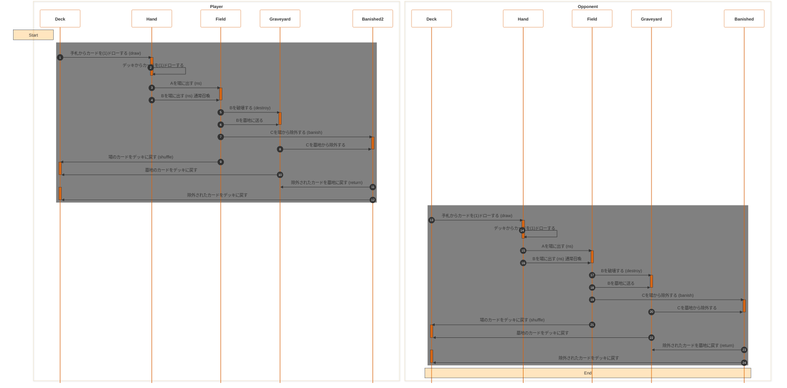

```mermaid
%%{init: {'sequence': { 'mirrorActors': false, 'rightAngles': true, 'messageAlign': 'center', 'actorFontSize': 20, 'actorFontWeight': 900, 'noteFontSize': 18, 'noteFontWeight': 600, 'messageFontSize': 14}}}%%
%%{init: {'theme': 'base', 'themeVariables': {'labelBoxBkgColor': 'lightgrey', 'labelBoxBorderColor': '#000000', 'actorBorder': '#D86613', 'actorBkg': '#ffffff', 'activationBorderColor': '#232F3E', 'activationBkgColor': '#D86613', 'noteBkgColor': 'rgba(255, 153, 0, .25)', 'noteBorderColor': '#232F3E'}}}%%

sequenceDiagram
    autonumber
    box Player 
    participant Deck as Deck
    participant Hand as Hand
    participant Field as Field
    participant Graveyard as Graveyard
    participant Banished as Banished2
    end
    Note left of Deck: Start

    
    box Opponent 
    participant Deck2 as Deck
    participant Hand2 as Hand
    participant Field2 as Field
    participant Graveyard2 as Graveyard
    participant Banished2 as Banished
    end

    rect gray
    Deck->>Hand: 手札からカードを(1)ドローする (draw)
    activate Hand
    Hand->>Hand: デッキからカードを(1)ドローする
    deactivate Hand

    Hand->>Field: Aを場に出す (ns)
    activate Field
    Hand->>Field: Bを場に出す (ns) 通常召喚
    deactivate Field

    Field->>Graveyard: Bを破壊する (destroy)
    activate Graveyard
    Field->>Graveyard: Bを墓地に送る
    deactivate Graveyard

    Field->>Banished: Cを場から除外する (banish)
    activate Banished
    Graveyard->>Banished: Cを墓地から除外する
    deactivate Banished

    Field->>Deck: 場のカードをデッキに戻す (shuffle)
    activate Deck
    Graveyard->>Deck: 墓地のカードをデッキに戻す
    deactivate Deck

    Banished->>Graveyard: 除外されたカードを墓地に戻す (return)
    activate Deck
    Banished->>Deck: 除外されたカードをデッキに戻す
    deactivate Deck
    end

    rect gray
    Deck2->>Hand2: 手札からカードを(1)ドローする (draw)
    activate Hand2
    Hand2->>Hand2: デッキからカードを(1)ドローする
    deactivate Hand2

    Hand2->>Field2: Aを場に出す (ns)
    activate Field2
    Hand2->>Field2: Bを場に出す (ns) 通常召喚
    deactivate Field2

    Field2->>Graveyard2: Bを破壊する (destroy)
    activate Graveyard2
    Field2->>Graveyard2: Bを墓地に送る
    deactivate Graveyard2

    Field2->>Banished2: Cを場から除外する (banish)
    activate Banished2
    Graveyard2->>Banished2: Cを墓地から除外する
    deactivate Banished2

    Field2->>Deck2: 場のカードをデッキに戻す (shuffle)
    activate Deck2
    Graveyard2->>Deck2: 墓地のカードをデッキに戻す
    deactivate Deck2

    Banished2->>Graveyard2: 除外されたカードを墓地に戻す (return)
    activate Deck2
    Banished2->>Deck2: 除外されたカードをデッキに戻す
    deactivate Deck2
    end
    Note over Deck2,Banished2: End
```