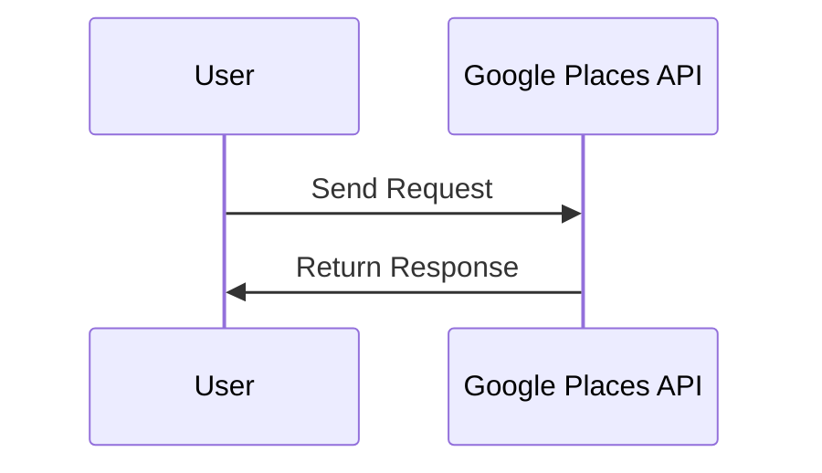
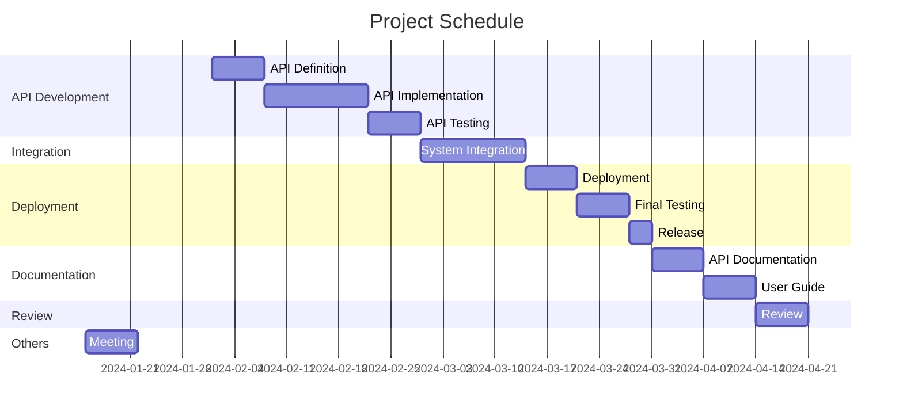

# Google Maps 口コミデータのAPI取得

## 要求
Google Mapsの口コミデータをAPIを通じて取得する。

## 要件
- Google Places APIを使用して口コミデータを取得する。
- 取得したデータはJSON形式であること。

### 想定利用者

## 基本設計

### API
- Google Places APIを使用します。詳細は[公式ドキュメント](https://developers.google.com/maps/documentation/places/web-service/overview)を参照してください。



### 権限

### 外部情報

API Base Url: `https://example.com/api/v1`

 #### General
 
|system name|API name|last updated|endpoint|Rate limit|cap|Special attributes|
|-|-|-|-|-|-|-|
|POST|API|2000-1-1|/posts|50 requests / 24h **PER APP/USER**|-|-|
|DELETE|API|2000-1-1|/posts/:id|50 requests / 24h **PER APP/USER**|-|-|
|GET|API|2000-1-1|/users/me|25 requests / 24h **PER APP/USER**|-|-|
 
 #### 200 (application/json)
 
- Params (application/json)

|No|key|require|null|type|desc|
|-|-|-|-|-|-|
| 1  | place | true    | null | string | Target place |

- Response:

|No|key|require|null|type|desc|
|-|-|-|-|-|-|
| 1  | status | true  | null | int  | HTTP status code |
| 2  | message | true | null | string | Success message |
| 3  | data    | true | null | object | Data payload |

#### 404 (application/json)

- Params (application/json)

|No|key|require|null|type|desc|
|-|-|-|-|-|-|
| 1  | place | true    | null | string | Target place |

- Response:

| No | key    | require | null | type   | desc               |
|-|-|-|-|-|-|
| 1  | status | true    | null | int    | HTTP status code   |
| 2  | message | true   | null | string | Error message      |
| 3  | data   | false   | true | null   | null          

### 実装例

以下にPythonを使用したサンプルコードを示します。


```python
import requests
import json

def get_reviews(place_id, api_key):
    url = f"https://maps.googleapis.com/maps/api/place/details/json?place_id={place_id}&fields=review&key={api_key}"
    response = requests.get(url)
    data = json.loads(response.text)
    return data["result"]["reviews"]

# 使用例
place_id = "YOUR_PLACE_ID"
api_key = "YOUR_API_KEY"
reviews = get_reviews(place_id, api_key)
for review in reviews:
    print(review["text"])

```

このコードは、指定した場所のIDとAPIキーを使用してGoogle Places APIから口コミデータを取得します。取得したデータはJSON形式で、それぞれの口コミはテキスト形式で出力されます。

## 非機能要件

# スケジュール



### 互換性情報

### 予算

|SNo.|Item|Qty|Unit Cost|Total Cost(JPY)|
|-|-|-|-|-|
|1|personnel|20,000|5|-|-|
|2|-|-|-|100,000|