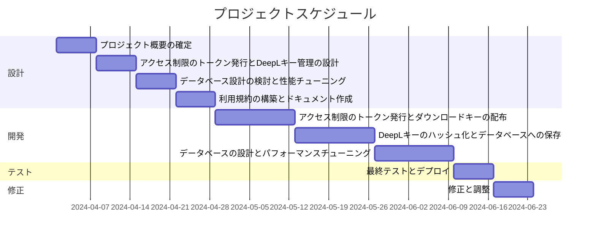

# 要件書

## 概要

このプロジェクトは、Gradio、SvelteKit(TypeScript)、FastAPI、SQL DB、BackBlaze(B2 Cloud Storage)、DeepL、Render.com、OAuth2、および PostgreSQL(pgAdmin4.exe) を使用して実装されます。LLM（Large Language Model）での解決は可能ですが、コストの観点から、古典的な数学的手法を使用して処理層を構築します。

## 実装

### フロントエンド（クライアントサイド）

1. **Gradio**: ユーザーインターフェースとして使用され、SvelteKitを介してフロントエンドと統合されます。
2. **SvelteKit(TypeScript)**: フロントエンドの開発に使用されます。

### バックエンド（サーバーサイド）

3. **FastAPI**: バックエンドのAPIを構築するために使用されます。

### データベース

4. **PostgreSQL (pgAdmin4.exe, [A5:SQL](https://a5m2.mmatsubara.com/tips/pgdb_connect/), [Sequerl Ace](https://sequel-ace.com/))**: データベース管理に使用されます。

### ストレージ

5. **BackBlaze(B2 Cloud Storage)**: アクセス制限されたストレージとして使用されます。トークンの発行とダウンロードキーの配布方法が必要です。

### 自然言語処理

6. **DeepL**: 自然言語処理のために使用されます。データはハッシュ化され、データベースに保存されます。バックグラウンドタスクとして処理され、処理後にデータが表示され、データベースから削除されます。

### 認証

7. **OAuth2**: 認証およびアクセス制御のために使用されます。

### デプロイメント

8. **Render.com**: アプリケーションのデプロイとホスティングに使用されます。

## 機能要件

## その他の要件

1. システムは高いセキュリティ基準に準拠し、ユーザーデータの機密性とプライバシーを保護します。
1. ユーザーインターフェースはモバイルフレンドリーであることが求められます。
1. データの整合性と信頼性を保証するために、適切なバックアップと復元戦略を実装します。
1. システムの拡張性と保守性を確保するために、モジュール化されたアーキテクチャを使用します。

## 開発における留意事項

1. BackBlazeストレージへのアクセス制御に関するトークンの発行とダウンロードキーの安全な配布方法が必要です。
1. メモリ管理は無料枠が512MBに制限されています。
1. ディープラーニングモデルの処理パフォーマンスは、DLが0.8秒、TSが22.3秒、UPが17秒である必要があります。
1. ドキュメントには利用規約が含まれる必要があります。
1. 英単語の後にスペースを入れることで、改行されずに1つの単語として解釈されるように留意します。
1. Render.comでのバックエンドエラーは、タイムアウトが原因と考えられます。この問題を解決するために、プロセスを分離し、本プロセスは裏側で処理を行うようにします。

## スケジュール

開発スケジュールは以下の通りです：

以上が、このプロジェクトの要件に関する要件書です。
