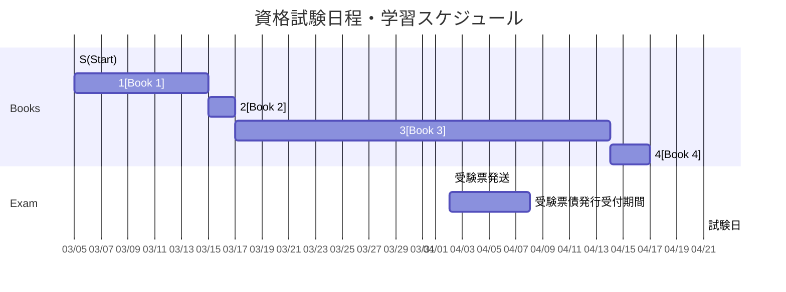

## Books
1. [徹底攻略 情報処理安全確保支援士教科書 令和6年度 - インプレスブックス](https://book.impress.co.jp/books/1123101058) (80h = 10d, 76p/d = 776pp)
1. [情報処理安全確保支援士過去問道場｜情報処理安全確保支援士.com](https://www.sc-siken.com/sckakomon.php) (16h = 2d, 10900p ~= 21750pp)
1. [2024 情報処理安全確保支援士「専門知識＋午後問題」の重点対策 - ビジネス・実用 - 無料で試し読み！DMMブックス(旧電子書籍)](https://book.dmm.com/product/4409306/s227asnph00067/) (224h = 28d, 31p ~= 860pp)
1. [うかる！ 情報処理安全確保支援士 午後問題集［第2版］ - ビジネス・実用 - 無料で試し読み！DMMブックス(旧電子書籍)](https://book.dmm.com/product/4343044/k296ankbp04991/) (24h = 3d, 125p ~= 376pp)

## Audio

- [Ppodcast - #セキュリティのアレ - ゆるーいセキュリティのポッドキャストですよ。](https://www.tsujileaks.com/)

## Extra
- [情報セキュリティ10大脅威 2023	](https://www.ipa.go.jp/security/10threats/10threats2023.html)
- [安全なウェブサイトの作り方](https://www.ipa.go.jp/security/vuln/websecurity/index.html)	
- [コンピュータセキュリティログ管理ガイド	](https://www.ipa.go.jp/security/reports/oversea/nist/ug65p90000019cp4-att/000025363.pdf)
- [ゼロトラスト・アーキテクチャ](https://www.pwc.com/jp/ja/knowledge/column/awareness-cyber-security/assets/pdf/zero-trust-architecture-jp.pdf)	
- [インターネットの安全・安心ハンドブック Ver5.00	](https://security-portal.nisc.go.jp/guidance/pdf/handbook/handbook-all.pdf)
- [CSIRTマテリアル](https://www.jpcert.or.jp/csirt_material/)	
- [証拠保全ガイドライン第9版	](https://digitalforensic.jp/wp-content/uploads/2023/02/shokohoznGL9.pdf)
- 

## Video
- [Youtube まさるの勉強部屋	](https://www.youtube.com/channel/UCgBf5j2KIkFBm29Z7fYDG1A/playlists)
- [Qiita 一番分かりやすい OAuth の説明	](https://qiita.com/TakahikoKawasaki/items/e37caf50776e00e733be)
- [Youtube 情報処理安全確保支援士会	](https://www.youtube.com/@user-bl9zz6vd4k)
