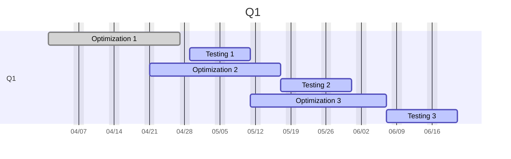
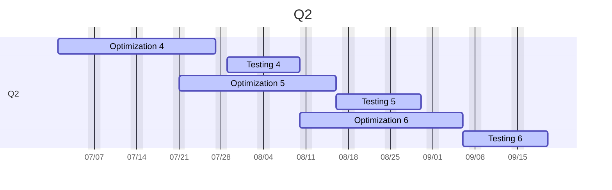
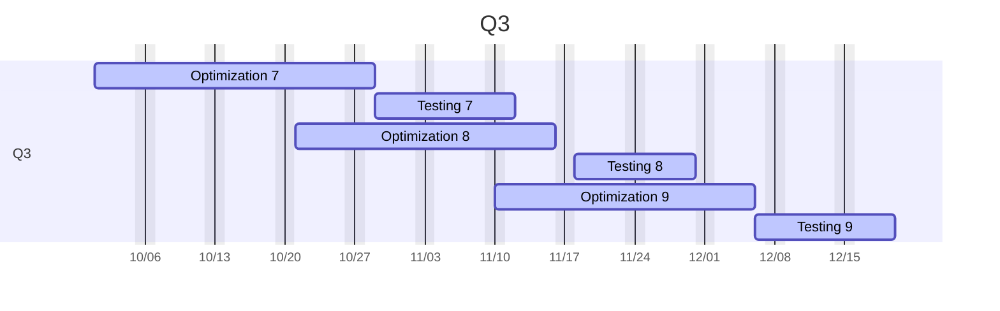
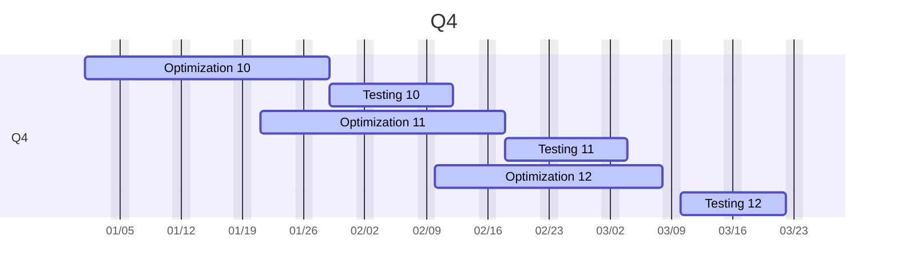

- walk forward test
- count: approx. 100/mon, 3/day
- shift range

```mermaid
gantt
    title Q1
    excludes weekends
    dateFormat  YYYY-MM-DD
    axisFormat %m/%d
    tickInterval 1week

    section Q1
    Optimization 1  :done, a1, 2024-04-01, 20d
    Testing 1       :active, after a1  , 10d
    Optimization 2  :active, a2, 2024-04-21, 20d
    Testing 2       :active, after a2 , 10d
    Optimization 3  :active, a3, 2024-05-11, 20d
    Testing 3       :active, after a3, 10d
```

```mermaid
gantt
    title Q2
    excludes weekends
    dateFormat  YYYY-MM-DD
    axisFormat %m/%d
    tickInterval 1week

    section Q2
    Optimization 4  :active, a4, 2024-07-01, 20d
    Testing 4       :active, after a4, 10d
    Optimization 5  :active, a5, 2024-07-21, 20d
    Testing 5       :active, after a5, 10d
    Optimization 6  :active, a6, 2024-08-10, 20d
    Testing 6       :active, after a6, 10d


```

```mermaid
gantt
    title Q3
    excludes weekends
    dateFormat  YYYY-MM-DD
    axisFormat %m/%d
    tickInterval 1week

    section Q3
    Optimization 7  :active, a7, 2024-10-01, 20d
    Testing 7       :active, after a7, 10d
    Optimization 8  :active, a8, 2024-10-21, 20d
    Testing 8       :active, after a8, 10d
    Optimization 9  :active, a9, 2024-11-10, 20d
    Testing 9       :active, after a9, 10d

```

```mermaid
gantt
    title Q4
    excludes weekends
    dateFormat  YYYY-MM-DD
    axisFormat %m/%d
    tickInterval 1week

    section Q4
    Optimization 10 :active, a10, 2025-01-01, 20d
    Testing 10      :active, after a10, 10d
    Optimization 11 :active, a11, 2025-01-21, 20d
    Testing 11      :active, after a11, 10d
    Optimization 12 :active, a12, 2025-02-10, 20d
    Testing 12      :active, after a12, 10d

```