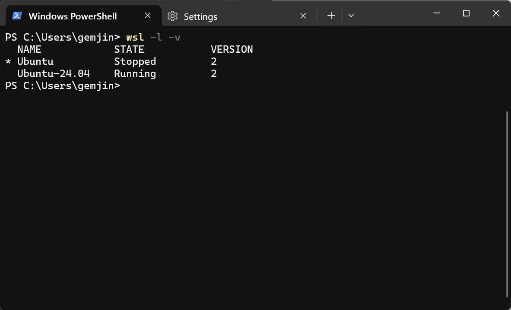
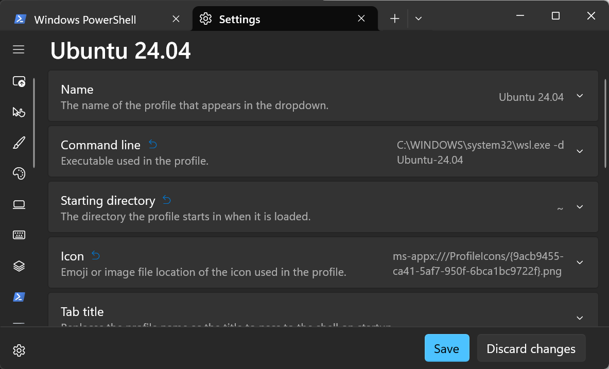
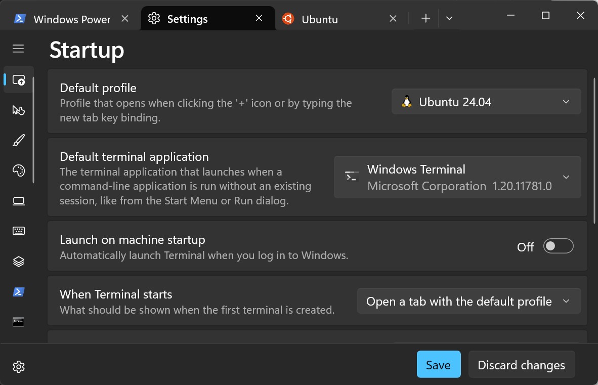

# WSLの設定

<div class='top' align='center'>
  
</div>
<div class="toc"></div>
<div style="page-break-after: always;"></div>

## Abstract

WSL2を設定およびカスタマイズするための設定ファイルやコマンドについて説明します。

## Introduction

WSL2（Windows Subsystem for Linux 2）は、Windows 10およびWindows 11で利用可能なLinux環境の仮想化プラットフォームです。Powershellを用いてインストールします。

## WSL2の導入

```powershell
wsl --install -d Ubuntu-24.04
wsl --status
```
username/passwordを控えてください。

## Windows Terminal.app の設定

- Distro名を確認する。


- プロファイルとして、起動コマンドを設定する。


- スタートアップのデフォルトに設定する。


## WSL2の設定

### .wslconfig

`.wslconfig`ファイルを作成することで、WSL2の動作をカスタマイズできます。以下は`.wslconfig`ファイルの例です。

```ini
[wsl2]
memory=8GB
swap=0
processors=2
networkingMode=mirrored
```

このファイルでは、WSL2仮想マシンのメモリ、スワップ、プロセッサの設定を調整できます。ファイルを作成または編集するには、次のPowerShellコマンドを使用します。
```powershell
code %USERPROFILE%/.wslconfig
```

### /etc/wsl.conf 

Linuxディストリビューション内でのWSL2の動作をカスタマイズするために、/etc/wsl.confファイルを使用できます。以下は一般的な設定例です。
```
[boot]
systemd=true

# [automount]
# default=true

# [network]
# generateHosts = false

[interop]
appendWindowsPath = false
```

このファイルでは、systemdの有効化やWindowsの環境変数へのパスの自動追加など、WSL2の動作に関する設定を調整できます。ファイルを作成または編集するには、次のコマンドを使用します。
```sh
sudo nano /etc/wsl.conf
```

### WSL2の再起動

WSL2の設定を変更した場合、変更を適用するためにWSL2を再起動する必要があります。次のPowerShellコマンドを使用してWSL2をシャットダウンできます。


```powershell
wsl --shutdown
```

以上がWSL2の設定およびカスタマイズに関する基本的な情報です。詳細な情報については、Microsoftの公式ドキュメントを参照してください。


## References

1. [WSL での詳細設定の構成](https://learn.microsoft.com/ja-jp/windows/wsl/wsl-config)
