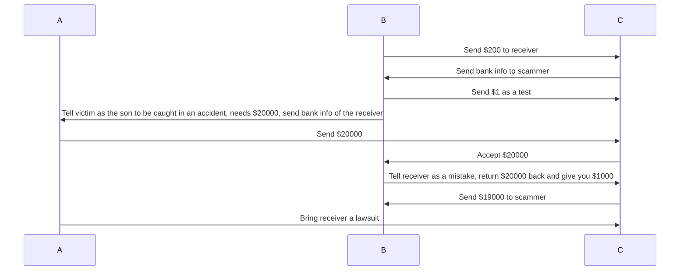

## Scheme 

```mermaid
sequenceDiagram
  participant A

  B ->> C: Send $200 to receiver
  C ->> B: Send bank info to scammer
  B ->> C: Send $1 as a test
  B ->> A: Tell victim as the son to be caught in an accident, needs $20000, send bank info of the receiver
  A ->> C: Send $20000
  C ->> B: Accept $20000
  B ->> C: Tell receiver as a mistake, return $20000 back and give you $1000
  C ->> B: Send $19000 to scammer
  A ->> C: Bring receiver a lawsuit
```