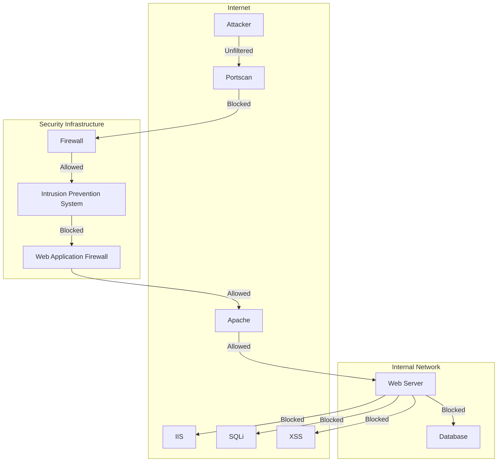

```mermaid
graph TD
    subgraph Internet
        A[Attacker]
        B[Portscan]
        C[Apache]
        D[IIS]
        E[SQLi]
        F[XSS]
    end

    subgraph Security Infrastructure
        FW[Firewall]
        IPS[Intrusion Prevention System]
        WAF[Web Application Firewall]
    end

    subgraph Internal Network
        G[Web Server]
        H[Database]
    end

    A -->|Unfiltered| B
    B -->|Blocked| FW
    FW -->|Allowed| IPS
    IPS -->|Blocked| WAF
    WAF -->|Allowed| C
    C -->|Allowed| G
    G -->|Blocked| H
    G -->|Blocked| D
    G -->|Blocked| E
    G -->|Blocked| F
```