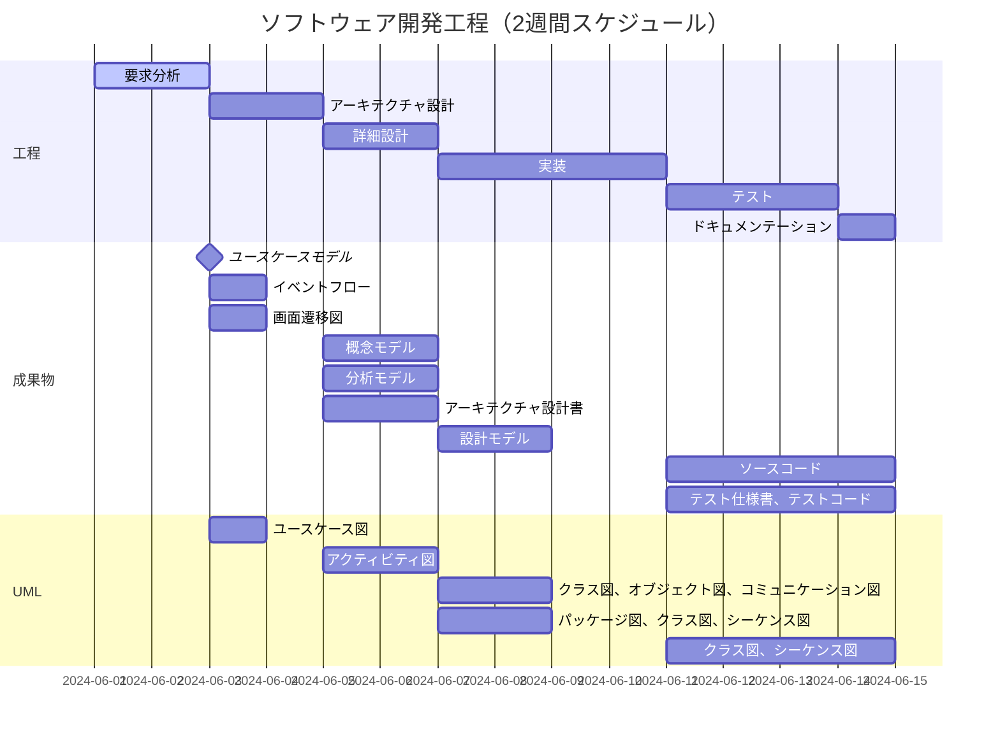

# ソフトウェア開発における作業優先順

工程
要求分析
1. 分析
1. アーキテクチャ設計
1. 詳細設計
1. 実装
1. テスト

成果物
1. ユースケースモデル
1. イベントフロー
1. 画面遷移図
1. 概念モデル
1. 分析モデル
1. アーキテクチャ設計書
1. 設計モデル
1. ソースコード テスト仕様書、テストコード

UML
ユースケース図
1. アクティビティ図
1. クラス図、オブジェクト図、コミュニケーション図
1. パッケージ図、クラス図、シーケンス図
1. クラス図、シーケンス図

<table><thead><tr><th>工程</th><th>主な成果物</th><th>UMLモデル図</th></tr></thead><tbody><tr><td>要求分析</td><td>ユースケースモデル イベントフロー 画面遷移図</td><td>ユースケース図 アクティビティ図 なし</td></tr><tr><td>分析</td><td>概念モデル 分析モデル</td><td>クラス図、オブジェクト図 コミュニケーション図</td></tr><tr><td>アーキテクチャ設計</td><td>アーキテクチャ設計書</td><td>パーッケージ図、クラス図 シーケンス図</td></tr><tr><td>詳細設計</td><td>設計モデル</td><td>クラス図、シーケンス図</td></tr><tr><td>実装</td><td>ソースコード</td><td>なし</td></tr><tr><td>テスト</td><td>テスト仕様書、テストコード</td><td>なし</td></tr></tbody></table>

RD:委任 UI:委任 SS-IT:請負
準委任推奨